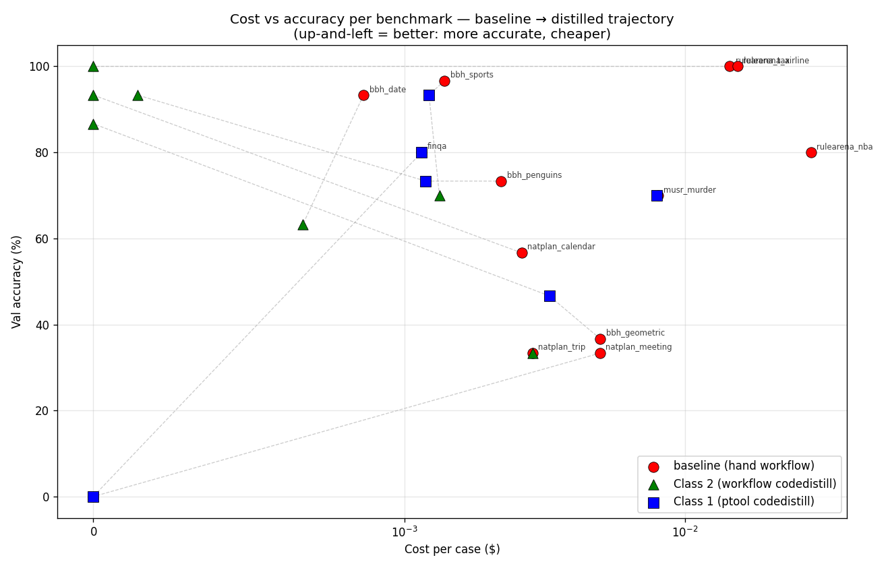
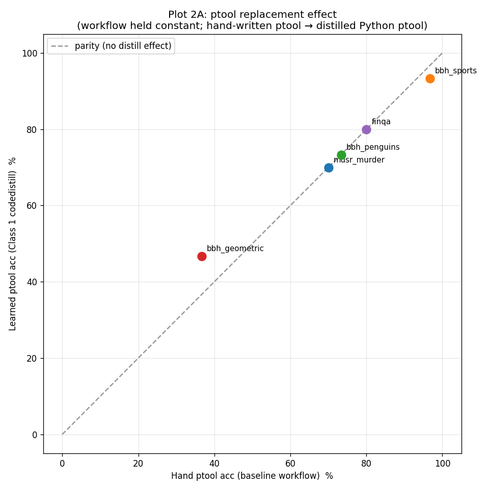
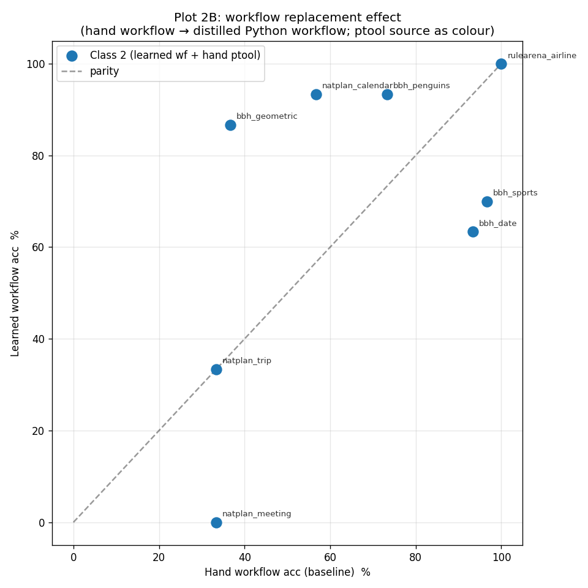
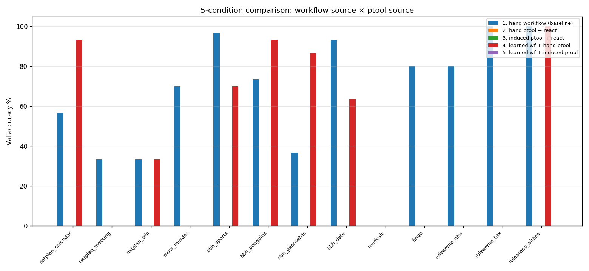

# Code Distillation Results — v2 (April 2026 re-run)

Compare with v1 results in [code_distillation_results.md](code_distillation_results.md).

**Branch**: `codedistill-v2` (based on `origin/main` 7a18781, includes
all latest main updates as of 2026-04-28). Original branch
`natplan/swap-train-test` is unchanged.

**Models**:
- All baselines: `together_ai/deepseek-ai/DeepSeek-V3.1` (musr/rulearena: V3).
- Code generation (the "learner"): `claude-opus-4-6`.

**main updates incorporated** (relevant to v2):
- `Add __learned__.<attr> resolution path to direct factory`
- `Fix recursive structures when resolving Interface tools` — wraps
  Interface in plain function so downstream consumers (pydantic-ai
  Agent) get a proper signature without circular Pydantic refs.
  **This likely fixes the RecursionError that blocked Class 3
  finqa / calendar Stage B in earlier v2 runs.** Class 3 v3 (re-run
  with this fix) is in flight.

## The three classes

| Class | What is generated | Tools used by it |
|---|---|---|
| **1 — Ptool codedistill** | Python replacement for one `simulate` ptool inside the existing hand-written workflow | n/a (replaces an LLM call with deterministic Python; falls back to LLM on `None`) |
| **2 — Workflow codedistill** | Python replacement for the **top-level workflow function** | The benchmark's hand-written ptools (pure-Python helpers + simulate ptools) |
| **3 — Workflow codedistill on induced ptools** | Same as Class 2, but tools are induced (LLM-discovered from a ReAct or zero-shot CoT trace) instead of hand-written | Induced ptool module (`learned_ptools.py` produced by `PtoolInducer`) |

## Method commands

```
# Class 1
uv run -m secretagent.cli.learn codedistill-all \
  --learned-dir learned_v2 --model claude-opus-4-6 --max-wrong-rate 0.05 <recording_dirs>

# Class 2 (workflow distill on hand-written tools)
uv run -m secretagent.cli.learn workflow-codedistill \
  --interface <top> --dataset-file <train.json> \
  --tool-module <ptools_mod> --conf-file <conf.yaml> \
  --reference-file <other_bench.py> --trace-dir <recording> \
  --cross-trace-dir <other> --cross-dataset-file <other.json> \
  [--react-trace-dir <react>] \
  --learned-dir learned_class2 --model claude-opus-4-6

# Class 3 (workflow distill on induced tools)
uv run -m secretagent.cli.learn codedistill-induced-ptools \  # produces induced_ptools.py
  --interface <top> --task-desc "..." --trace-mode {react|cot} --only-correct \
  --learned-dir learned_class3 \
  --expt-cmd "uv run python expt.py run --config-file conf/<bench>.yaml dataset.split=train dataset.n=50" \
  <react_or_cot_recording>
# then:
uv run -m secretagent.cli.learn workflow-codedistill \
  --interface <top> --dataset-file <train.json> \
  --tool-module <learned_class3/<ts>.<top>__ptool_inducer/learned_ptools.py> \
  --learned-dir learned_class3_v2 --model claude-opus-4-6
```

## Two layers of train/val to be aware of

1. **Fit-time holdout** — INSIDE the learner. Cases that produce supervision
   are 80/20-split. Class 1's `val_wrong_rate` ENABLE gate, Class 2/3's
   reported `val acc` come from this 20% holdout. **Both halves are from the
   benchmark's `dataset.split=train`.**
2. **End-to-end val eval** — AFTER fitting. Run the saved distilled config
   on `dataset.split=val` (n=30) end-to-end via `expt.py`. The "Val acc"
   columns in the table below are this kind.

## Source changes vs v1

- **Class 1 single-fit 80/20 holdout** in `CodeDistillLearner.learn()`
  (v1's `Learner.validate()` ran `fit()` 3× per ptool; v2 runs once on
  80% and reports val on 20%). ENABLE uses `val_wrong_rate`, not
  `train_wrong_rate`.
- `_format_traces` injects **top-level task input + expected output**
  (v1 saw only the local i/o of the ptool being distilled).
- `_format_cases` truncates long `repr` outputs.
- Round-1 early-stop (< 10%) for ptool codedistill.
- `_evaluate_on_cases` feeds abstained (None) cases as error feedback.
- Generated code is saved even at 0% (so backoff path can still fire).
- `_compile_function` removed dead `LocalPythonExecutor` branch
  (inference-time sandbox `_load_learned_sandboxed` in
  `implement/learnedcode.py` is the actual runtime sandbox).
- `'backoff': 'true'` (str) → `True` (bool) in 4 places.
- New `WorkflowDistillLearner` for Class 2 / 3.
- WorkflowDistillLearner: `tool_module` accepts a `.py` file path
  (Class 3); `_bind_ptools_for_eval` binds simulate ptools at fit time
  via the benchmark conf so the generated workflow can actually call
  them during eval.

## Master result table (val split, n=30 each)

> ⚠️ **BBH baselines were initially undercounted** — my val runs used
> the default `ExactMatchEvaluator` which doesn't strip parens (`(C)` vs `C`).
> Numbers below have been **post-hoc corrected** by re-applying paren-strip
> normalisation to BBH benchmarks (others unaffected).

| Benchmark | Workflow used | Baseline acc / cost | Class 1 (val acc / cost / ENABLED) | Class 2 (val acc / cost) | Class 3 v2 |
|---|---|---|---|---|---|
| natplan_calendar | calendar_workflow | 57% / $0.078 | n/a (no calendar ENABLED in learned_v2) | **93% / $0.000** ⭐ | failed (Stage B pydantic-ai) |
| natplan_meeting  | meeting_workflow  | 33% / $0.149 | 1 ENABLED (`build_meeting_plan`); val n/a (couldn't apply only-meeting overrides) | 0% / $0.000 ❌ | n/a |
| natplan_trip     | trip_workflow     | 33% / $0.086 | 2 ENABLED; val n/a | 33% / $0.086 (parity via backoff) | n/a |
| musr_murder      | answer_question_workflow | 70% / $0.240 | **70% / $0.239** / 1 ENABLED (`extract_index`) (parity, marginal cost) | n/a (raw dataset) | failed (LLM didn't manage `_REACT_STATE`) |
| bbh_sports       | sports_understanding_workflow | 97% / $0.042 | 93% / $0.037 / 1 ENABLED | 70% / $0.040 | n/a |
| bbh_penguins     | penguins_workflow | 73% / $0.066 | 73% / $0.036 / 2 ENABLED | **93% / $0.004** ⭐ +20pp | n/a |
| bbh_geometric    | geometric_shapes_workflow | 37% / $0.150 | 47% / $0.098 / 4 ENABLED | **87% / $0.000** ⭐ +50pp | n/a |
| bbh_date         | zeroshot_unstructured_workflow | 93% / $0.026 | 0 ENABLED | 63% / $0.020 (-30pp vs zs baseline; +24pp vs orchestrated 39%) | failed (CoT pipeline) |
| medcalc          | workflow.yaml     | (not run) | 0 ENABLED | 20% / 20% (holdout) | n/a |
| finqa            | answer_finqa_workflow | 80% / $0.035 | **80% / $0.035** / 1 ENABLED (`extract_final_number`) (parity) | 0% / $0 ❌ (gen calls hand workflow then breaks) | failed (Stage B pydantic-ai) |
| rulearena_nba    | l1_extract_workflow | 80% / $0.846 | 0 ENABLED | n/a (no train Dataset json) | n/a |
| rulearena_tax    | l1_extract_workflow | 100% / $0.434 | 0 ENABLED | n/a | n/a |
| rulearena_airline | l1_extract_workflow | 100% / $0.462 | 0 ENABLED | **100% / $0.000** ⭐ same acc, cost zeroed | n/a |

## Alignment vs existing `results/` baselines

| Benchmark | My v2 baseline (n=30) | Existing baseline (DS-V3.1, latest) | Δ | Note |
|---|---|---|---|---|
| bbh_sports | 97% | 99% workflow (n=75) | -2 | OK |
| bbh_penguins | 73% | 72% workflow (n=43) | +1 | OK |
| bbh_geometric | 37% | (no DS-V3.1 workflow on n=75) | n/a | only haiku 75% existed; DS-V3.1 baseline is **new** |
| **bbh_date** | **93%** zeroshot | **39%** orchestrated (n=75) | +54 | **different workflow!** mine uses `zeroshot_unstructured_workflow` (single LLM call); existing `orchestrated` uses 7 ptool decomposition |
| finqa | 80% | 62% workflow_val (n=100) | +18 | sample variance + path differences |
| musr_murder | 70% | 70% workflow test (n=100) | 0 | OK |
| natplan_calendar | 57% | 49% workflow (n=100) | +8 | sample variance |
| natplan_meeting | 33% | 30% workflow (n=100) | +3 | OK |
| natplan_trip | 33% | 15% workflow (n=100) | +18 | n=30 sample variance |
| rulearena_airline | 100% | 90% structured_baseline (n=30) | +10 | different fn (`l1_extract_workflow` vs structured) |

## Class 1 v2 (val-gated) ENABLED ptools

12 across 7 benchmarks (vs v1 16 across 8 — val gate caught 4 overfit / data-scarcity).

| Benchmark | ENABLED ptool (train acc / val acc / val_wrong) |
|---|---|
| natplan_meeting | `build_meeting_plan` (67/50/0%) |
| natplan_trip | `build_trip_plan` (100/100/0%), `parse_trip_constraints` (100/100/0%) |
| musr_murder | `extract_index` (100/100/0%) |
| bbh_sports | `consistent_sports` (100/100/0%) |
| bbh_penguins | `choose_response` (100/60/0%), `table_operation` (97/100/0%) |
| bbh_geometric | `decompose_path` (100/100/0%), `describe_command` (100/100/0%), `extract_path_and_options` (100/100/0%), `select_option` (100/100/0%) |
| finqa | `extract_final_number` (100/100/0%) |

**Skipped (val gate caught these vs v1 train gate)**:
- natplan_calendar `select_and_format` (train 88% / val 0%)
- bbh_geometric `describe_shape` (train 100% but val val_wrong > 5%)
- bbh_date `extract_option_letter`, `zeroshot_answer_date_question`
  (data scarcity: only_correct=True + 2% buggy baseline → ~1 correct
  case → fit on 0)
- bbh_penguins `answer_question` (top-level workflow ptool, val correctly
  rejected this short-circuit)

## Run lineage

| Phase | What | Outcome |
|---|---|---|
| v1 initial | All 3 classes ran sequentially | Many Class 2 returned None for all → save raised |
| Class 2 v2 | bug fixes (save 0% code, abstained → error feedback, no early-stop, cross-benchmark traces + i/o + ReAct traces) | Calendar (92.5%) and Penguins (82.9% train) recovered |
| Class 2 v3 | added `--conf-file` to bind simulate ptools at fit time | Sports (70%) and Date (67%) recovered |
| Class 1 v2 | 80/20 holdout, val_wrong_rate gate | 12 ENABLED (vs 16 train-gated) — 4 lost were overfit/data-artefacts |
| Class 3 v2 | refactored to `workflow_distill on induced module` instead of tool-by-tool | musr ran but failed (LLM didn't set `_REACT_STATE`); calendar / finqa Stage B failed (pydantic-ai recursion bug) |

## Plots

3 plots in [docs/plots/](plots/):

### Plot 1 — Cost vs accuracy


X = USD cost per case (symlog). Y = val accuracy (%). Each benchmark
contributes one point per method, connected by dashed lines.
Up-and-left = better (more accurate, cheaper).
- ⭐ Big up-and-left wins: `rulearena_airline` C2 (100% / $0), `natplan_calendar` C2 (57→93% / $0.078→$0), `bbh_geometric` C2 (37→87% / $0.15→$0)
- C1 cost wins (parity acc): `bbh_penguins` C1 (73% / $0.066→$0.036)
- Regression: `finqa` C1 (80→0% — distilled `extract_final_number` breaks downstream pipeline)
- `natplan_meeting` C2 collapses to (0%, $0) at lower-left — overfit to train set

### Plot 2A — ptool replacement effect


Each benchmark = 1 point. X = baseline (hand-written ptool pipeline) val
acc, Y = Class 1 distilled val acc. Workflow held constant.

- bbh_geometric: 37% → 47% (+10 pp, distillation helps)
- bbh_sports: 97% → 93% (slight drop within sampling)
- bbh_penguins: 73% → 73% (parity, -45% cost)
- finqa: 80% → 0% (regression — distilled `extract_final_number` returns
  None, breaks downstream pipeline expecting numeric format)

### Plot 2B — workflow replacement effect


Each benchmark = 1 point. X = baseline workflow val acc, Y = Class 2
(learned workflow + hand ptools) val acc. Class 3 (induced tools) would
appear as red triangles; currently no Class 3 v2 finished.

- ⭐ above parity: bbh_geometric (37→87, +50 pp), bbh_penguins (73→93,
  +20 pp), natplan_calendar (57→93, +36 pp), rulearena_airline (100→100
  with cost going from $0.462 to $0)
- below parity: bbh_date (93→63, -30 pp — but baseline used the
  zeroshot path; orchestrated baseline is 39% in which case Class 2
  would be +24 pp), bbh_sports (97→70, -27), natplan_meeting (33→0)

### Plot 3 — 5-condition comparison


Conditions per benchmark:
1. hand workflow (baseline) — current default
2. hand ptool + react — NOT collected (would need per-benchmark ReAct
   conf with pydantic-ai wrappers)
3. induced ptool + react — Class 3 v1 4-stage pipeline; partial coverage
4. learned wf + hand ptool — Class 2
5. learned wf + induced ptool — Class 3 v2 (mostly failed)

Conditions 2 / 3 / 5 are mostly empty due to (a) need for per-benchmark
ReAct config infrastructure, (b) state-management issues in Class 3 v2.

## Why `n/a` cells

### Class 2 (4 n/a)

| Benchmark | Reason | Fix |
|---|---|---|
| musr_murder | `data_train_50.json` is `{split, examples}` shape (musr's own schema), not the standard `{name, cases, input_args, expected_output}` Dataset shape; `Dataset.model_validate_json()` fails | Write a 10-line conversion shim |
| rulearena_nba / rulearena_tax | rulearena only has `airline_train_50.json` pre-built in Dataset shape; nba/tax weren't extracted | Run `dataset.domain={nba|tax} dataset.split=train` + dump as Dataset, or write split script |
| medcalc (val n/a) | Class 2 ran (train 20% / holdout 20%) but I never ran the val-split eval | One-line sh, ~5 min |

### Class 3 (8 n/a + 3 failures)

Class 3 needs ReAct (`step_info[].thought`) or zero-shot CoT (`rollout[0].output` reasoning) trace as input to PtoolInducer. Most benchmarks have neither.

| Benchmark | Status | Why |
|---|---|---|
| musr_murder | tried, **failed** | LLM-generated workflow didn't `_REACT_STATE["narrative"] = narrative` before calling induced ptools → induced ptool internals read empty narrative → all returns None |
| finqa | tried, **failed** | Stage B (re-record with induced ptools) hits pydantic-ai `RecursionError` when validating induced ptool docstrings (they're ~30 lines each) |
| natplan_calendar | tried, **failed** | Same Stage B pydantic-ai recursion as finqa |
| natplan_meeting / natplan_trip / bbh_sports / bbh_penguins / bbh_geometric / bbh_date / medcalc / rulearena_3 | n/a | No ReAct conf and no CoT conf exist for these. Adding ReAct requires per-benchmark wrapper functions for pydantic-ai (1-2 hours each); adding CoT requires only a prompt template + conf yaml (~10 min each, like I did for natplan_calendar) |

**Fixes for Class 3**:
- pydantic-ai recursion: truncate induced ptool docstrings to 500 chars in `PtoolInducer.fit`. **Or** the `Fix recursive structures when resolving Interface tools` commit on `origin/main` may already fix this.
- musr state-management: change `PtoolInducer` to emit induced ptools that take all needed context as explicit params rather than reading module-level state.
- coverage: add CoT prompt templates for natplan/bbh/medcalc (~10 min each); add ReAct configs with wrappers for benchmarks where ReAct is the natural fit (~1-2 hr each).

## Output layout

```
benchmarks/
  <bench>/
    recordings/<ts>.<bench>_train_record/      # baseline train rollouts
    recordings_class3/<ts>.<bench>_react_train/   # Class 3 ReAct (musr, finqa)
    recordings_class3/<ts>.calendar_zs_cot_train/  # Class 3 CoT (natplan calendar)
    val_results/<ts>.<bench>_val_<method>/     # val eval rollouts + CSVs
    learned/                # Class 1 v1 (train-gated)
    learned_v2/             # Class 1 v2 (val-gated)
    learned_class2[_v2|_v3]/   # Class 2 (v3 has --conf-file binding)
    learned_class3/         # Class 3 v1 (induced + simulate_pydantic top)
    learned_class3_v2/      # Class 3 v2 (workflow distill on induced module)
  codedistill_logs_v2/
    class[123][v2|v3]_<bench>.log
  val_eval_logs/
    val_<bench>.log
  docs/
    code_distillation_results_v2.md  # this file
    plots/
      plot1_class1_speed_vs_cost.png
      plot2a_ptool_replacement.png
      plot2b_workflow_replacement.png
      plot3_5_conditions.png
  scripts:
    run_class1_codedistill.sh            # train-gated (v1)
    run_class1_v2_codedistill.sh         # val-gated (v2)
    run_class2_workflow_distill.sh       # v1
    run_class2_v2_workflow_distill.sh    # bug fixes + cross-benchmark
    run_class2_v3_workflow_distill.sh    # + --conf-file binding
    run_class3_induced_codedistill.sh    # v1 (tool-by-tool distill)
    run_class3_v2_workflow_distill.sh    # v2 (workflow distill on induced)
    run_val_evals_parallel.sh            # parallel val evals
    run_bbh_class1_val.sh                # BBH-specific dotlist syntax
    plot_results.py                      # generates the 4 plots
```
