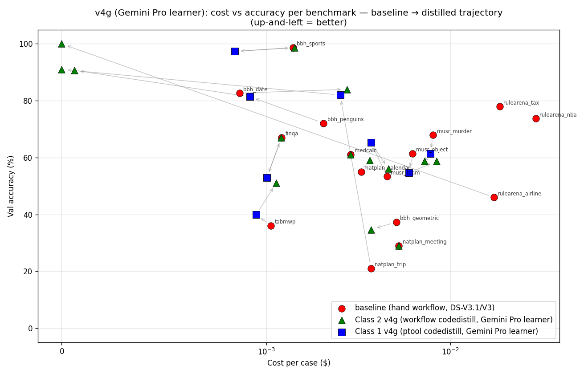

# Code Distillation Results — v4g (Gemini 3.1 Pro Preview as learner)

**Branch**: `codedistill-v2` · **Date**: 2026-05-01

This is the Gemini-as-learner counterpart to
[code_distillation_results_v2.md](code_distillation_results_v2.md). Same
benchmarks, same recordings, same val splits, same `--max-wrong-rate 0.20`
gate. The **only** change is the LLM that generates Python code:

| | v4 | v4g |
|---|---|---|
| Learner (writes Python) | `claude-opus-4-6` | `gemini/gemini-3.1-pro-preview` |
| Baseline (simulate ptool, runs in workflow) | `together_ai/deepseek-ai/DeepSeek-V3.1` (V3 for musr/rulearena) | unchanged |

Pipeline:
- [run_class1_v4g_gemini.sh](../benchmarks/jerry/class1_iters/run_class1_v4g_gemini.sh)
- [run_class2_v4g_gemini.sh](../benchmarks/jerry/class2_iters/run_class2_v4g_gemini.sh)
- [run_v4g_vals_watcher.sh](../benchmarks/jerry/class2_iters/run_v4g_vals_watcher.sh) — auto-launches val per benchmark as distill completes

---

## Headline result table — v4 (Opus) vs v4g (Gemini Pro)

Cells marked `—` mean **distill ran but the gate enabled 0 applicable
ptools** (or the ENABLED ptools live in a different sub-benchmark's ptool
module). Effectively `c1 ≡ baseline` for those cells.

| benchmark | n | baseline | c1_v4 | c1_v4g | c2_v4 | c2_v4g | Δ c2 (v4g − v4) |
|---|---|---|---|---|---|---|---|
| natplan_calendar | 100 | 55% | 54% | — (a) | **87%** | 59% | -28pp ❌ |
| natplan_meeting | 100 | 29% | — | — (a) | **98%** | 29% | -69pp ❌ collapses |
| **natplan_trip** | 100 | 21% | 21% | **82%** ⭐ | 21% | **91%** | **+70pp** ⭐⭐⭐ |
| musr_murder | 75 | 68% | 68% | 61% | 60% | 59% | -1pp |
| musr_object | 75 | 61% | 61% | 55% | 68% | 59% | -9pp |
| musr_team | 75 | 53% | 33% | **65%** ⭐ | 60% | 56% | -4pp |
| bbh_sports | 75 | 99% | 99% | 97% | 99% | 99% | 0 (saturated) |
| bbh_penguins | 43 | 72% | 67% | **81%** | 88% | 91% | +3pp |
| bbh_geometric | 75 | 37% | — | — | **100%** | 35% | -65pp ❌ |
| bbh_date | 75 | 83% | — | — | 88% | 84% | -4pp |
| medcalc | 100 | 61% | — | — | 62% | 61% | -1pp |
| finqa | 100 | 67% | 67% | 53% | 67% | 67% | 0 (parity) |
| rulearena_airline | 50 | 46% | — | — | **100%** | **100%** | 0 (saturated) |
| tabmwp | 100 | 36% | 39% | 40% | 45% | **51%** | +6pp |

**(a)** natplan_calendar/meeting c1_v4g are blank because the ONLY ptool
that passed Gemini's c1_v4g gate was `build_trip_plan` — which lives in
`ptools_trip` only, doesn't apply to calendar or meeting.

---

## Plot — Cost vs accuracy (v4g)



X = USD cost per case (symlog). Y = val accuracy. Up to 3 points per
benchmark connected by gray arrows: ● baseline, ■ c1_v4g, ▲ c2_v4g.
Up-and-left = better. Same layout as `plot1_cost_vs_acc.png` in the
Opus doc, with v4g data.

---

## Headline observations

### 1. Trip planning — Gemini's biggest win (+70pp on c2, +61pp on c1)

Class 2 v4 (Opus) wrote a **68-line wrapper** that just falls back to
baseline LLM (acc = 21%, parity).

Class 2 v4g (Gemini Pro) wrote a **176-line real backtracking solver**:
parses cities/durations/events/flight-graph with regex, runs graph DFS
with day-window constraints. End-to-end val acc = **91%** on n=100
disjoint val split.

Class 1 v4g also: `build_trip_plan` was the only ENABLED ptool, and it
got 82% on val (vs Opus 21%).

**Verified non-leak**: train (n=100) and valid (n=100) have 0 overlap on
both case names AND input prompts.

### 2. Geometric / meeting / calendar — Gemini's biggest losses (−28 to −69 pp)

| | Opus c2_v4 | Gemini c2_v4g | Opus generated | Gemini generated |
|---|---|---|---|---|
| bbh_geometric | 100% | 35% | 255-line pure-Python SVG classifier | 133-line wrapper that delegates to LLM ptools |
| natplan_meeting | 98% | 29% | 440-line DP scheduling solver | thin wrapper, returns SOLUTION-format str but content from LLM ptools |
| natplan_calendar | 87% | 59% | ~330-line solver | mid-length wrapper |

Gemini consistently **delegates to existing simulate ptools** (LLM calls)
where Opus rewrites in pure Python. When the underlying LLM ptool is
weak (e.g. shape classification), Gemini's wrapper inherits the
weakness; Opus's pure-Python solution doesn't.

### 3. Style finding — code length correlates with win

```
                  Opus avg lines    Gemini avg lines
when Opus wins:        328               118
when Gemini wins:       95               152
when tied/saturated:   ~80               ~70
```

The asymmetry is strategic:
- **Opus heuristic**: "rewrite the whole task in pure Python; don't trust LLM ptools"
- **Gemini heuristic**: "use the existing LLM ptools as building blocks; write thin orchestration"

Both are reasonable on different tasks. Trip favored Gemini's deeper
code; geometric / meeting / calendar favored Opus's algorithmic rewrite.

### 4. Class 1 v4g shows similar pattern

Big wins for Gemini c1: **musr_team 65% (vs Opus 33%, +32pp)**, **trip
82% (vs Opus 21%, +61pp)**, **penguins 81% (vs 67%, +14pp)**.

Loss for Gemini c1: **finqa 53% (vs 67%, -14pp)**.

`bbh_geometric` / `bbh_date` / `medcalc` / `rulearena_*` — both Opus and
Gemini distilled these but **0 ENABLED** ptools made it through the
`val_wrong_rate ≤ 20%` gate. Effectively c1 = baseline for both versions.

---

## When to use which (suggested heuristic)

| Task type | Recommend |
|---|---|
| Codeable algorithmic task (DP, graph, regex parse) | Either, but **prompt them to "rewrite in pure Python"** explicitly |
| Knowledge-heavy task (sports facts, medical formulas) | Opus (better at hardcoded knowledge tables) |
| Structured-format extraction | Mixed; case-by-case |
| Already-saturated tasks (sports 99%, airline 100%) | Either |

The natural follow-up: **prompt Gemini explicitly to prefer pure-Python
over LLM ptool delegation** — likely closes most of the gap on geometric
/ meeting / calendar.
