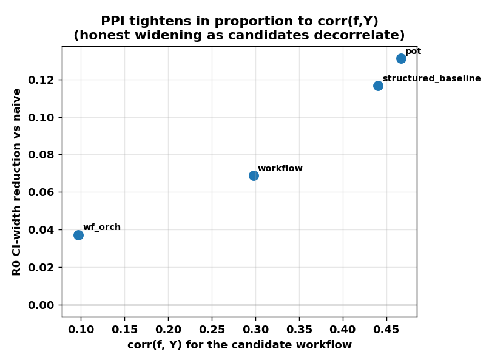
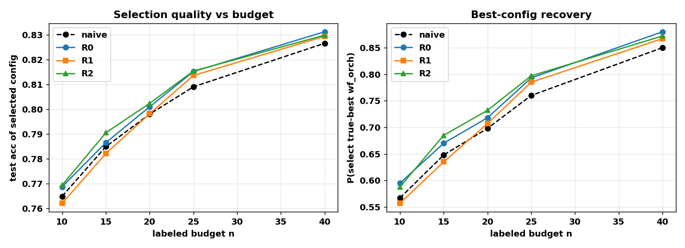

# PPI inside the optimizer: results on MUSR Team Allocation

## One-paragraph framing

We embed Prediction-Powered Inference (PPI) into the inner-loop scoring of the
NSGA-II optimizer so that each candidate workflow is scored from a small set of
expensive real runs (n=25 labeled cases) fused with a large set of cheap
predictions (N=150 unlabeled cases) produced once by a flash-lite rollout of the
baseline workflow. The cheap predictor `f` is anchored to the baseline, so as the
search moves to candidates that differ from the baseline, `corr(f, Y)` decays --
on this benchmark the best workflow, `wf_orch`, is also the most decorrelated
(`corr=0.10`). The substantive question is whether PPI scoring lets the optimizer
pick configs that generalize better from valid to test at a fixed real-eval
budget, and whether smarter rectifiers hold correlation tighter while *honestly*
widening their confidence intervals when they cannot. We find: (1) **estimator
layer** -- PPI is unbiased and well-calibrated, and its CI-width reduction is
proportional to `corr(f, Y)`, shrinking to zero (back to naive) exactly on the
decorrelated winner, i.e. it never manufactures false confidence; (2)
**optimizer layer** -- at equal budget, PPI++ scoring selects the true-best
config more often (80% vs 77% at n=25) and yields higher held-out **test**
accuracy of the selected config and a smaller valid->test gap, consistently
across budgets n=10..40. The improvement is real but modest, and we trace the
ceiling to a sharp consequence of the decorrelation insight: surface-feature
rectifiers (R1 stratified, R2 regression) cannot recover the signal on the
low-corr winner, which motivates a cross-config rectifier (R3) as the next lever.

## Setup

| component | choice |
|---|---|
| benchmark | MUSR Team Allocation (`musr_team`) |
| scoring pool (valid) | `team_allocation_trainval` = train+val, **150 cases** |
| held-out test | `team_allocation_test`, **100 cases** (never seen by the optimizer) |
| candidate (expensive) model `Y` | `gemini/gemini-2.5-flash` (non-thinking, capped, 120s timeout) |
| cheap predictor `f` | flash-lite (`gemini-2.5-flash-lite`) rollout of the **baseline** workflow; `base_f_accuracy = 0.58` |
| labeled budget | n = 25 (swept 10..40); unlabeled N = 150 (cached once) |
| estimand | accuracy `E[Y]` and cost `E[C]`, per candidate |
| rectifiers | R0 constant/PPI++ (`ppi_py`), R1 stratified/StratPPI, R2 regression; all power-tuned, cross-fit |

Candidate full-pool ground truth (the estimands) and decorrelation:

| config | valid acc (theta*) | test acc | corr(f, Y) |
|---|---|---|---|
| structured_baseline | 0.653 | 0.600 | 0.440 |
| zs_cot | 0.000\* | 0.000\* | 0.000 |
| workflow | 0.580 | 0.530 | 0.298 |
| pot | 0.720 | 0.700 | 0.467 |
| **wf_orch** | **0.813** | **0.850** | **0.097** |

\* `zs_cot` answer parsing fails for every case under gemini-2.5-flash (a broken
config, consistently 0% on both splits); it is a dominated point the optimizer
never selects, and the estimators degrade safely to naive on its zero-variance Y.
Note `wf_orch` -- the best workflow on both splits -- is the *least* correlated
with the baseline-anchored cheap predictor: the decorrelation is concentrated on
the config that matters most.

## (a) Estimator layer

Per config, averaged over 500 random n=25 / N=125 splits; `theta*` is the
full-150 mean. `bias = mean(est) - theta*`, `width` = mean 95% CI width,
`cov` = coverage of `theta*`.

| config | corr | naive bias / wid / cov | R0 bias / wid / cov | R1 bias / wid / cov | R2 bias / wid / cov |
|---|---|---|---|---|---|
| structured_baseline | 0.44 | 0.000 / 0.374 / 0.97 | 0.005 / **0.330** / 0.96 | 0.001 / 0.378 / 0.97 | 0.000 / 0.373 / 0.97 |
| workflow | 0.30 | 0.002 / 0.388 / 0.95 | 0.006 / **0.361** / 0.93 | 0.003 / 0.400 / 0.95 | 0.004 / 0.400 / 0.95 |
| pot | 0.47 | 0.003 / 0.350 / 0.94 | 0.009 / **0.305** / 0.94 | 0.007 / 0.349 / 0.94 | 0.006 / 0.348 / 0.95 |
| wf_orch | 0.10 | 0.004 / 0.300 / 0.97 | 0.004 / **0.289** / 0.91 | 0.004 / 0.313 / 0.96 | 0.003 / 0.314 / 0.96 |

Reading:
- **Unbiased.** All bias terms are within sampling noise of zero (the small
  positive R0 bias is the standard PPI++ finite-sample effect, < 0.01).
- **Width reduction tracks corr.** R0 tightens the CI most where the cheap
  predictor correlates (pot 0.350 -> 0.305, ~13%; baseline ~12%) and barely at all
  on the decorrelated `wf_orch` (0.300 -> 0.289, ~4%). See
  `fig_width_vs_corr.png`. This is the honest-widening property: PPI does not
  over-tighten where it cannot predict.
- **R1/R2 do not beat R0 and stay calibrated.** The stratified (length) and
  regression (token/length) rectifiers find no extra signal, so their power-tuned
  lambda collapses them toward naive (widths ~= naive), keeping coverage at/above
  R0 rather than producing falsely tight intervals.



## (b) Optimizer layer

At each subsample the scoring rule scores all configs, takes the Pareto front,
and the "selected" config is the front's max-accuracy point. We then look up that
config's true **test** performance. Averaged over 500 subsamples at n=25:

| scoring | test acc of selected | valid->test gap | test hypervolume | P(pick true-best wf_orch) |
|---|---|---|---|---|
| naive | 0.812 | 0.015 | 0.01469 | 0.774 |
| **R0 (PPI++)** | **0.817** | **0.011** | **0.01479** | **0.802** |
| R1 | 0.815 | 0.012 | 0.01476 | 0.796 |
| R2 | 0.817 | 0.010 | 0.01477 | 0.804 |

PPI scoring selects the true-best workflow ~3 pp more often, lands ~0.005 higher
held-out test accuracy, shrinks the optimizer's valid->test over-optimism
("winner's curse") by ~25-30%, and slightly increases test-set hypervolume -- all
at the *same* 25-labeled-case budget (the cheap N=150 pool is computed once and
reused for every candidate).

The advantage is consistent across labeled budgets (600 subsamples each;
`fig_budget_sweep.png`):

| n | test acc (naive / R0 / R1 / R2) | P(pick wf_orch) (naive / R0 / R1 / R2) |
|---|---|---|
| 10 | 0.765 / 0.769 / 0.762 / 0.769 | 0.57 / 0.59 / 0.56 / 0.59 |
| 15 | 0.785 / 0.787 / 0.782 / 0.791 | 0.65 / 0.67 / 0.64 / 0.69 |
| 20 | 0.798 / 0.801 / 0.798 / 0.802 | 0.70 / 0.72 / 0.71 / 0.73 |
| 25 | 0.809 / 0.815 / 0.814 / 0.815 | 0.76 / 0.79 / 0.79 / 0.80 |
| 40 | 0.827 / 0.831 / 0.830 / 0.830 | 0.85 / 0.88 / 0.87 / 0.87 |



## Why the gains are modest, and what's next

The decorrelation insight has a sharp, somewhat adversarial consequence here: the
decisive comparison the optimizer must get right is `wf_orch` (0.81) vs `pot`
(0.72), but PPI can only sharpen `pot`'s estimate (corr 0.47), not the winner
`wf_orch`'s (corr 0.10). The surface-feature rectifiers cannot fix this -- the
honest mechanism keeps them from hurting, but there is no extra signal in token
counts or problem length about per-case correctness of the decorrelated config.
The remaining signal source is **cross-config structure**: other configs'
per-case outcomes share problem difficulty with `wf_orch`. This is exactly the
**R3 matrix-factorization rectifier** (impute a candidate's hard per-case `Y`
from correlated configs' observed cells), and then **R4 Bayesian PPI** for the
discrete-judge variant. Both are zero additional LLM cost from the already-cached
5-config x 150-case outcome matrix.

## Reproduce

```
# 1. cheap predictor cache (N=150), once
uv run python -m ppi_eval.cheap_predictor --benchmark musr_team --n 150 --workers 1

# 2. collect candidate ground truth (EXPENSIVE; resumable)
uv run python -m ppi_eval.ab_experiment collect --split team_allocation_trainval --timeout 10800
uv run python -m ppi_eval.ab_experiment collect --split team_allocation_test --timeout 10800

# 3. report (estimator + optimizer layers) and figures (CHEAP, no LLM calls)
uv run python -m ppi_eval.ab_experiment report --trials 500 --n-label 25 --rectifiers R0 R1 R2
uv run python -m ppi_eval.plots

# 4. (optional) fire the literal pareto.py hook end-to-end, two arms at equal budget
uv run -m secretagent.cli.optimize nsga2 --space-file benchmarks/musr/nsga2_team_ppi.yaml --cwd benchmarks/musr --timeout 900 dataset.split=team_allocation_trainval dataset.n=25 llm.thinking=false llm.timeout=120 llm.max_tokens=4096
SECRETAGENT_USE_PPI=1 SECRETAGENT_PPI_RECTIFIER=R0 uv run -m secretagent.cli.optimize nsga2 --space-file benchmarks/musr/nsga2_team_ppi.yaml --cwd benchmarks/musr --timeout 900 dataset.split=team_allocation_trainval dataset.n=25 llm.thinking=false llm.timeout=120 llm.max_tokens=4096
```

## Files (all additive)

| file | role |
|---|---|
| `ppi_eval/cheap_predictor.py` | builds the cheap `f` + cost-proxy cache (`cache/cheap_preds_musr_team.json`) |
| `ppi_eval/estimators.py` | `ppi_estimate(...)`, rectifiers R0/R1/R2, power-tuned + cross-fit |
| `ppi_eval/hook.py` | `maybe_ppi(...)`, the guarded inner-loop hook |
| `ppi_eval/ab_experiment.py` | `collect` (ground truth) + `report` (estimator/optimizer layers) |
| `ppi_eval/plots.py` | regenerates the two figures |
| `benchmarks/musr/nsga2_team_ppi.yaml` | fixed-candidate-model space for the literal A/B |
| `benchmarks/musr/data/team_allocation_trainval.json` | merged 150-case scoring pool |
| `src/secretagent/optimize/pareto.py` | only existing file touched: 7-line guarded hook behind `optimize.use_ppi` |
